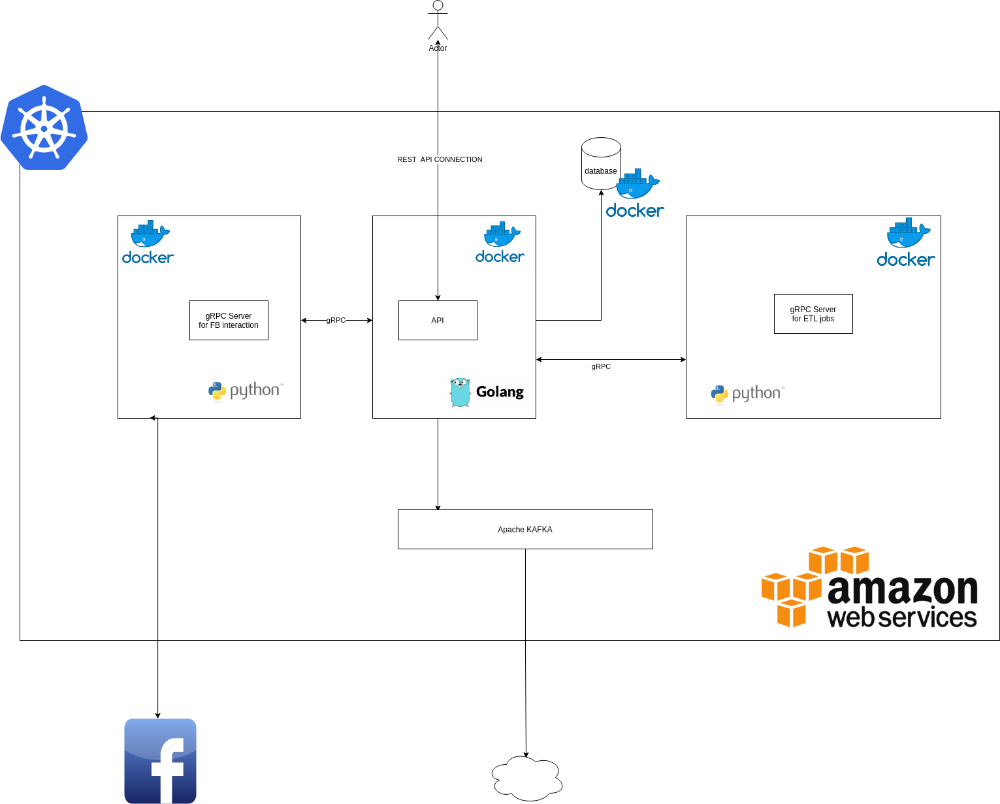

# API Facebook Ads Library

This server is used for interact with facebook ads library, query and save the results, also imlements basic ELT process.

Also this server is part of the following microservices arquicture.

